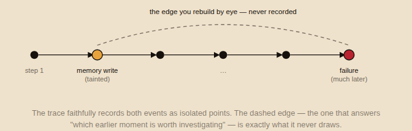
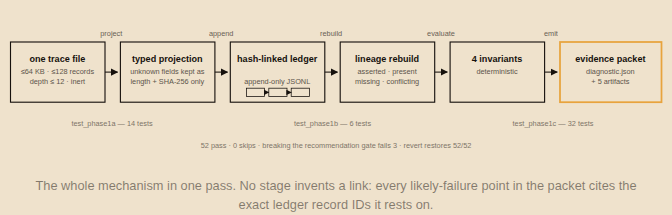
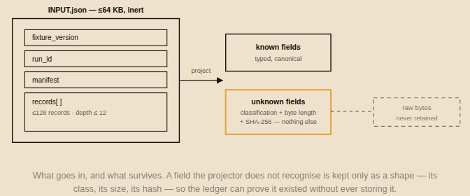
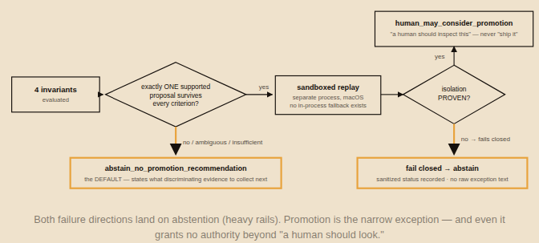
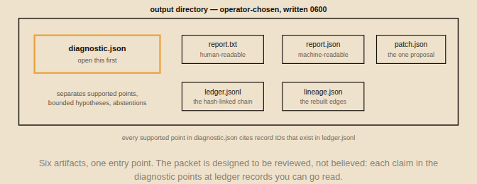
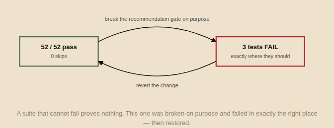

# Trajectory Ledger

**A failing agent trace tells you what happened. It won't tell you which moment to investigate.**

Trajectory Ledger is a local, standard-library-only Python 3.11 CLI that turns one bounded, inert
agent-trace file into a reviewable evidence packet: where the recorded evidence supports
investigating, the smallest reversible change it suggests, and whether that change reverses
cleanly. Every claim cites the exact ledger records behind it — and when the evidence is thin,
**it abstains by default.**

📖 **[Read the launch post](https://abhid.substack.com/p/a-failing-agent-trace-tells-you-what)** ·
▶ **[Interactive playground](https://trajectory-ledger.vercel.app)** ·
🤗 **[Fixture dataset](https://huggingface.co/datasets/abhid1234/trajectory-ledger-fixtures)**

---

## The problem

An agent reuses a tainted memory entry it saved early in a run. The run derails much later. The
trace faithfully records both the write and the failure — but never links them, and a final score
can't localize the moment. You rebuild the lineage by eye.



## How it works

One pass over one bounded file (≤64 KB, ≤128 records, depth ≤12 — synthetic or redacted, always inert):



Unknown fields survive only as a classification, a byte length, and a SHA-256 — the raw bytes are
never retained:



## Abstention is the default

Unless exactly one supported proposal survives every mechanical criterion, the recommendation stays
`abstain_no_promotion_recommendation` — and the packet states what discriminating evidence to
collect next. For the one supported case, an out-of-process macOS-sandboxed replay compares and
reverses the exact saved-task document; if isolation can't be proven, it fails closed. No
in-process fallback exists.



The strongest output it can emit:

```
recommendation=human_may_consider_promotion
authority=human_review_only_no_external_action
replay_criteria_passed=true
```

`human_may_consider_promotion` means "a human should inspect this candidate" — never "ship it."

## Quickstart

Requires Python 3.11+ and macOS (for the sandboxed replay path; everything else runs anywhere).

```sh
git clone https://github.com/abhid1234/trajectory-ledger
cd trajectory-ledger
PYTHON_BIN=python3.11 ./scripts/local_demo.sh
```

First result in **0.21 s**, identical across two consecutive runs — no network, no credentials, no
account. Six artifacts land in the output directory; open `diagnostic.json` first:



Run your own synthetic or redacted fixture:

```sh
PYTHONPATH=. python3.11 -m trajectory_ledger.cli INPUT.json OUTPUT_DIR --attest abstain
```

## The proof

**71 tests.** And because a suite that cannot fail proves nothing, the core was broken on purpose:



## What it does not do

- Synthetic or redacted fixtures only. No causation, no efficacy, no localization claims.
- The hash chain can't authenticate a source assertion, and without an external anchor can't
  guarantee detection of truncation or rewrite from genesis.
- Replay is host-specific (macOS `sandbox-exec`); reversal restores the baseline document digest
  only.
- It does not apply changes, promote candidates, ingest live traces, call models, or write
  production state.

See [`THREAT-MODEL.md`](THREAT-MODEL.md) and [`PRODUCT-BRIEF.md`](PRODUCT-BRIEF.md) for the full
boundary.

## Links

- 📖 Launch post: https://abhid.substack.com/p/a-failing-agent-trace-tells-you-what
- ▶ <a name="playground"></a>Playground: https://trajectory-ledger.vercel.app
- 🤗 <a name="dataset"></a>Fixture dataset on Hugging Face: https://huggingface.co/datasets/abhid1234/trajectory-ledger-fixtures
- Related open formats by the same author: [groundproof](https://github.com/abhid1234/groundproof) ·
  [provenant](https://github.com/abhid1234/provenant) · [skillproof](https://github.com/abhid1234/skillproof) ·
  [memport](https://github.com/abhid1234/memport)

## License

MIT © Abhi Das. See [LICENSE](./LICENSE).
